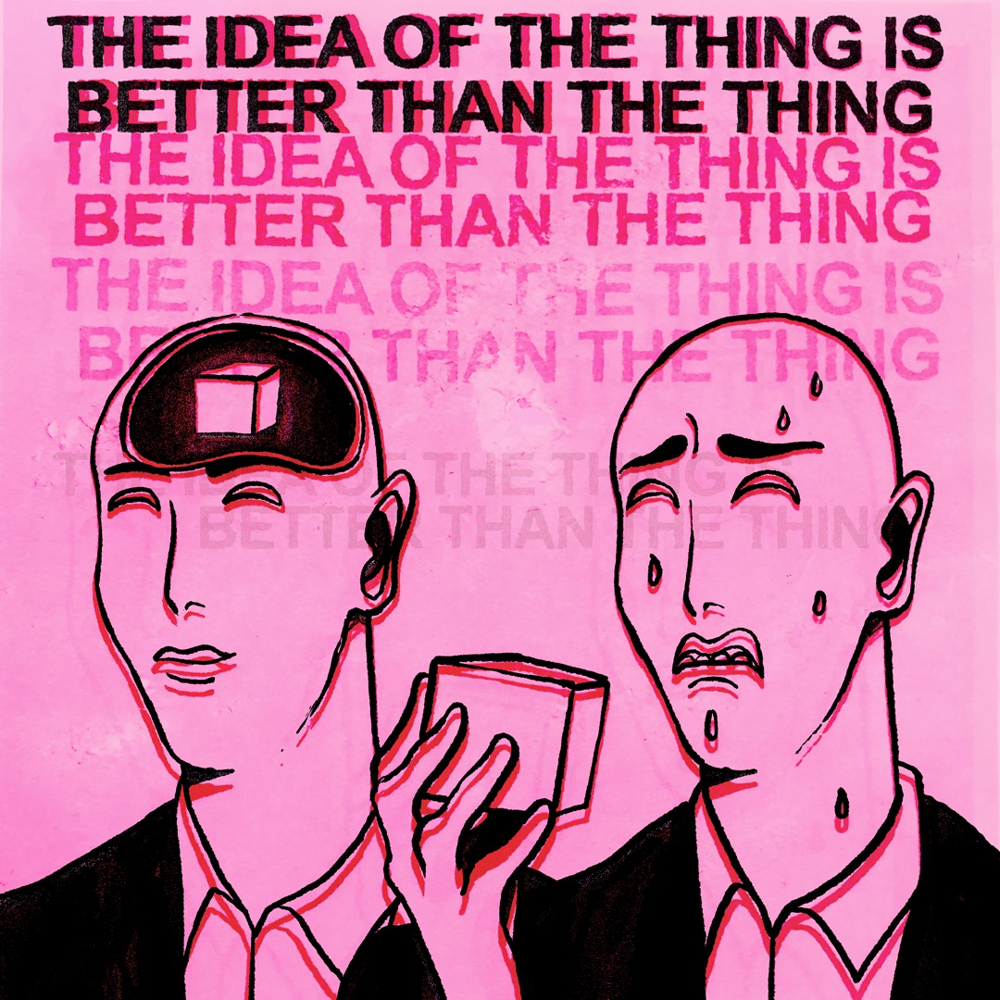

&emsp; &emsp; &emsp; &emsp; &emsp;  

 

&emsp; &emsp; &emsp; &emsp; &emsp; 

<h2 align="center" style="font-size: 30px"> ~ 📇 Nice to meet you! 📇 ~</h2>
 

<h3 p align="center" >
<i><b>   :pill::stethoscope: I suffer from a severe case of autodidactism!:adhesive_bandage::drop_of_blood:</i></b></h3>
 

  

 
 

<!-- 
<i><b> But even still, I am--</i></b></h3>

 

  

  -->

<h2 align="center" style="font-size: 20px"> ~ 📝 Wanna know what I actually do? 📝 ~</h2>

<h3 >
&emsp; &emsp; &emsp; &emsp; &emsp; &emsp; &emsp; &emsp; &emsp; &emsp; <b> Check out some of my modest achievements. 🧐 </b></h3>

 &emsp; &emsp; &emsp; &emsp; &emsp; &emsp;   &emsp; &emsp; &emsp; &emsp; &emsp; &emsp; .png>)

&emsp; 
&emsp; 
&emsp;
&emsp; 
&emsp; 
&emsp;
&emsp; 
&emsp;

<h3 >
&emsp; &emsp; &emsp; &emsp; &emsp; &emsp; &emsp; &emsp; &emsp; <b> When I'm not debugging K8s clusters I'm babbling in these: </b></h3>

&emsp; &emsp; &emsp; &emsp; &emsp; &emsp; &emsp; &emsp; &emsp; &emsp; &emsp; &emsp; &emsp; &emsp; &emsp; &emsp; 

<table width="100%" align="center">
<tr>
<td align="center">
<a href="https://www.credly.com/users/plamen-dimitrov.c0ef874c">
<strong>Check out my Credly Profile! </strong> 

 
 

</a>

</td>

<td align="center">
<a href="https://steamcommunity.com/profiles/76561198015227442/">
<strong>You can even add me on Steam!</strong>
 
 

 
</a>

</td>
</tr>
</table>
 
 

<!--  -->

<!-- Counter goes here -->

  

