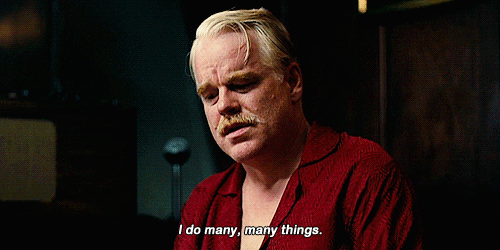
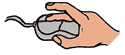

&emsp; &emsp; &emsp; &emsp; &emsp;  

&emsp; &emsp; &emsp; &emsp; &emsp;  

 

&emsp; &emsp; &emsp; &emsp; &emsp; 

<h2 align="center" style="font-size: 30px"> ~ 📇 Nice to meet you! 📇 ~</h2>
 

<h3 p align="center" >
- <i><b> I am a writer, a doctor, a nuclear physicist and a theoretical philosopher.</i></b></h3>
 

  

 
 

  

 

<h2 align="center" style="font-size: 20px"> ~ 📝 Wanna know what I actually do? 📝 ~</h2>

 
 

<table width="100%" align="center">
<tr>
<td align="center">
<a href="https://google.com">
<strong>Check out my page on the Internet! </strong>

 
 

</a>

</td>

<td align="center">
<a href="https://steamcommunity.com/profiles/76561198015227442/">
<strong>You can even add me on Steam!</strong>
 
 

 
</a>

</td>
</tr>
</table>
 
 

<!-- Counter goes here -->

  

